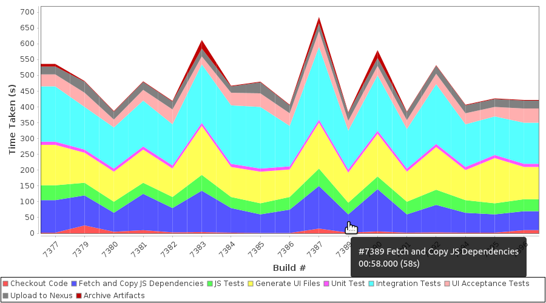

# Build Time Blame Plugin
A Jenkins plugin for analyzing the historical console output of a Job with the goal of determining which steps are taking the most time.

## Requirements:
 + Jenkins Version >= `2.164.1`
 + [Timestamper Plugin](https://wiki.jenkins-ci.org/display/JENKINS/Timestamper)

## What it does:
 This plugin scans console output for successful builds.
 If the line matches one of the configured regex keys, it will store the timestamp generated for that line by the Timestamper Plugin.
 Then, it generates a report showing how those steps contributed to the total build time.
 This is intended to help analyze which steps in the build process are good candidates for optimization.

#### The plugin produces:

 + A Build Time Trend graph showing what portion of the total build time each step has taken over the scanned builds.
     

 + A Last Successful Build Times table showing each line that was matched in the most recent build.
 This helps analyze if the steps being matched are correct.
    

 + A Mean Successful Build Times table showing the mean amount of time each step has taken across all successful builds.

    

## How to use it:
1. Install Plugin

1. Restart Jenkins

1. Each job will now have a new action:

    

1. Enable Timestamps for any jobs you want to analyze (the report will only include results for builds where this plugin was enabled):

    
1. The report will be pre-populated with regex to denote the start and end of the job:

    

1. Add/Update regex statements to match parts of the build process.
    + Regex Search Key: Lines in the console output that match this regex string will be added to the report.
    These keys should match when the particular step has begun.
    Make sure to add another match for when that step is complete or the next begins to get the correct elapsed time in the report.
    + Label: The matches will be shown with this label in the report.
    + Only Use First Match: If this box is checked, the search key will not be checked against after the first line it matches.
1. (Optional) Set a limit on the "Maximum Builds To Process"
   + By default, the logs for all successfully completed builds will be scanned. 
   For some jobs with long logs or many builds, limiting the report may allow it to load more quickly.
1. Click `Reprocess Report`.
This will regenerate the report by searching for the configured steps in the console output for each successful run of the job that had Timestamps enabled.
Note: This process can take some time for jobs with a lot of console output and/or a lot of build history.

1. When the report executes, the results for each build are cached.
When the report is reloaded, the plugin will check for other successful builds that have not been processed and update the report accordingly.
